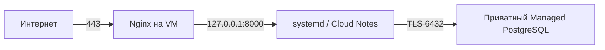
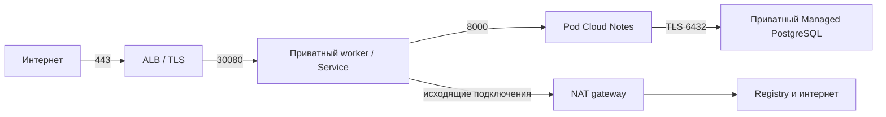

# Архитектура и границы ответственности

NLB — отдельный промежуточный опыт: TCP 80 → NodePort 30081 → Pod 8000.
Это не дополнительный слой перед ALB. Service типа LoadBalancer **запрашивает**
создание NLB у cloud controller; он не является отдельным сетевым hop после NLB.
Gateway/HTTPRoute — желаемая конфигурация для Gwin, не отдельные прокси.
Gwin согласует её с ресурсами ALB.

VM использует subnet 10.10.10.0/24; Kubernetes — 10.20.10.0/24,
Pods 10.96.0.0/16, Services 10.112.0.0/16. Subnet принадлежит зоне,
VPC объединяет subnet. VPC сама по себе здесь не имеет единственного /16 CIDR.
Диапазоны не должны пересекаться с локальной сетью/VPN.

| Владелец | Ресурсы |
|---|---|
| UI/оператор | Folder, bootstrap IAM, DNS zone/delegation, registry, сертификат |
| OpenTofu VM | VPC, subnet, SG, IP, VM, PostgreSQL, A-запись VM |
| OpenTofu K8s | VPC/NAT/subnet/SG, service accounts/roles, master/worker, PostgreSQL |
| Ansible | Пользователь Linux, приложение, venv, systemd, Nginx, Certbot |
| kubectl | Namespace, ConfigMap, Secret, CA, schema Job, внешние Service, Gateway |
| Helm | Только Deployment и ClusterIP Service приложения после занятия 9 |
| Cloud controller / Gwin | NLB / ALB и их дочерние ресурсы |

В учебном варианте одна зона, один worker и один PostgreSQL host. Это не HA:
рестарт worker прерывает обслуживание. Production потребует нескольких зон,
реплик, резервирования БД, контроля доступа к API приложения и защищённого state.
Не увеличивайте стенд до production ради первого знакомства.

## API

`GET /healthz` — 200 при живом процессе, даже если БД недоступна.
`GET /readyz` — 200 после доступности таблицы, иначе 503.
`POST /notes` принимает `{"text":"1–1000 символов"}`, возвращает 201 и `{id,text}`.
`GET /notes` возвращает последние 100 записей, новые первыми.
SQL параметризован, соединение открывается на запрос и закрывается после него.
Это намеренно простой пример без пула, авторизации и миграционного фреймворка.
Схема создаётся отдельно командой `python -m notes.db`, а не при запуске каждого Pod.
